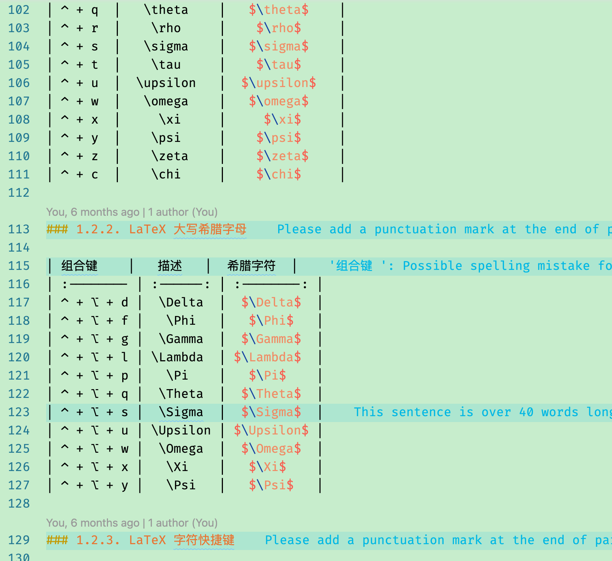

# README
This is an eye protection color theme for Visual Studio Code. Except the default color settings, this theme extension also specifies colors for some scopes of C/Cpp, TeX/LaTeX, R, Matlab, Python, Java, Markdown, Perl, Shell, CSS, Diff, PHP, Ruby, HTML, JS.
### How to install

1. Press **Ctrl+Shift+P (MacOS, Cmd+Shift+P**) to open the Command Palette.
2. Enter **Install Extension**.
3. Search **Eye Protection**.
4. Select it or press Enter to install.

### Screenshots:

#### C++

#### LaTeX

#### MarkDown

#### Matlab

#### Python

**Enjoy!**
